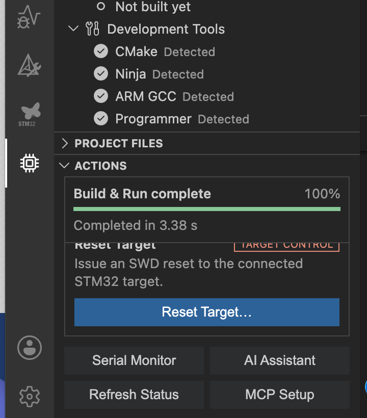

# Dockyard32 — STM32 for macOS

Dockyard32 is a lightweight, graphical STM32 workflow for macOS and Visual Studio Code. It keeps code editing in the native VS Code editor and wraps existing CMake, GNU Arm, STM32CubeProgrammer, ST-LINK, and serial tools behind structured Core APIs.

> **0.3.x is an Apple Silicon Preview, not a stable release.** Keep independent recovery/programming tools available and validate generated firmware and conversion output before production use.

> Dockyard32 is an independent community project. It is not affiliated with, endorsed by, or supported by STMicroelectronics, Arm, Keil, or Microsoft. STM32, STM32Cube, ST-LINK, Arm, Keil, and Visual Studio Code are trademarks of their respective owners.

## Highlights

- Detects STM32CubeMX `.ioc`, CMake, and Keil MDK `.uvprojx` projects.
- Builds with CMake/Ninja and publishes GCC diagnostics to VS Code Problems.
- Flashes, verifies, and resets over ST-LINK with STM32CubeProgrammer CLI.
- Provides a native macOS serial monitor with bounded logs and `waitSerial()`.
- Runs Save → Build → Flash → Verify → Reset → Serial from one graphical action.
- Imports selected Keil MDK 5/6 project inputs into a native macOS CMake copy.
- Exports configured CMake projects to an ARM Compiler 6 Keil project.
- Detects FreeRTOS automatically and captures live tasks, kernel objects, mutex ownership, and wait relationships through ST-LINK + GNU Arm GDB.
- Keeps UI, controller, Core, Agent API, and local stdio MCP layers separate.



## Requirements

| Component | Requirement |
| --- | --- |
| Host | macOS 13 or newer on Apple Silicon (`darwin-arm64`) |
| Editor | Visual Studio Code 1.96 or newer |
| Build | CMake and GNU Arm Embedded; Ninja recommended |
| Program | STM32CubeProgrammer CLI and ST-LINK |
| Cube projects | STM32CubeMX-generated CMake project or compatible CMake tree |
| Development | Node.js 22.20 and pnpm 11.19 |
| Keil validation | Windows with Keil MDK and ARM Compiler 6; not required for macOS import/build |

STM32CubeCLT or the tool bundles installed by STM32Cube for Visual Studio Code can provide CMake, Ninja, and GNU Arm. Tool paths can also be selected in the graphical VS Code settings.

## Installation

### Install a release VSIX

1. Download `dockyard32-<version>-darwin-arm64.vsix` from GitHub Releases.
2. In VS Code, open **Extensions** → **…** → **Install from VSIX…**.
3. Select the VSIX and reload the VS Code window when prompted.
4. Open an STM32 project folder and select the Dockyard32 icon.

No terminal is required for normal Build, Flash, Reset, serial, import, or export use.

### 60-second quick start

1. Install the VSIX and reload VS Code.
2. Open the folder containing the STM32 `.ioc`, `CMakeLists.txt`, or Keil `.uvprojx` file.
3. Open **Dockyard32** in the Activity Bar and wait for tool/device detection.
4. Select **Build Project**, then use **Flash Firmware** or **Build & Run**.
5. Open **STM32 Serial**, choose a `/dev/cu.*` port and baud rate, and select **Connect**.
6. For a FreeRTOS debug build, open **Dockyard32 RTOS** and select **Capture Snapshot**.

### Build from source

```text
corepack enable
pnpm install --frozen-lockfile
pnpm run check
pnpm run package:vsix
pnpm run check:vsix
```

The generated VSIX is written to the repository root.

## Supported workflows

| Workflow | Status |
| --- | --- |
| STM32G474 + Cube/CMake + ST-LINK + UART | Primary |
| STM32F407 + Cube/CMake + ST-LINK + UART | Tested |
| STM32F103 + Cube/CMake | Conversion/unit tested; hardware regression pending |
| STM32F1/F4/G4 family detection | Supported with conservative device profiles |
| GCC errors and warnings | Structured Problems with source navigation |
| Keil MDK 5/6 → macOS CMake | Best-effort source conversion |
| CMake → Keil ARM Compiler 6 | Best-effort project generation |
| Keil ARM Compiler 5 export | Not generated |
| Windows-native Keil build from macOS | Not provided; export and validate on Windows |
| FreeRTOS automatic detection | Preview; `.ioc`, sources, headers, CMake, and ELF symbols |
| FreeRTOS live inspection | Preview; tasks, queues, semaphores, mutex owners, and wait relationships |
| ThreadX / Zephyr | Detection only; live task reading is not implemented |

See the detailed [support matrix](docs/support-matrix.md).

## Keil conversion safety

- Import rejects filesystem roots, the user home directory, and parent directories broad enough to contain the home directory.
- Import trusts only the `.uvprojx` directory by default (or an explicitly approved open workspace), copies selected Target sources and recursively resolved `#include` dependencies, and maps external files individually into `External/`.
- Before import, the graphical flow shows selected file count, total size, external file count, and an external-directory summary.
- Export copies compile-command sources, recursively resolved `#include` dependencies, and detected precompiled libraries instead of complete include directories.
- Import and export both require empty destination directories. Existing files are never overwritten.
- Conversion reports use relative or redacted external paths and do not record the local username or absolute home path.
- Multiple Keil Targets and unknown MCUs require an explicit graphical selection.

## Conversion limitations

Conversion is not binary- or layout-equivalent by definition. Always inspect the generated report and compare map files before deploying production firmware.

The following commonly require manual work:

- ARMCC proprietary language extensions, inline assembly, and non-GNU assembly files.
- Custom scatter execution-region semantics that cannot be represented exactly in a GNU linker script.
- Bootloader offsets, overlays, copy tables, absolute placement, external memory initialization, and custom startup logic.
- Precompiled `.lib` files from ARM Compiler 5, which GNU Arm cannot link.
- GCC `.a` libraries whose ABI, floating-point ABI, LTO mode, or C++ runtime differs from ARMClang.
- Linker flags, specs files, semihosting choices, and vendor middleware license constraints.
- Projects that do not expose an accurate `compile_commands.json`.

The exporter resolves relative command directories, split and joined `-I`/`-D` forms, common options, and per-file options. Unsupported GCC-only options are reported or omitted rather than silently treated as ARMClang equivalents.

## Development and checks

```text
pnpm run check:unit       # TypeScript, lint, Core and conversion tests
pnpm run test:integration # Real VS Code Extension Host activation test
pnpm run package:vsix     # Reproducible darwin-arm64 VSIX with flattened runtime dependencies
pnpm run check:vsix       # Target, native-module, privacy, and archive checks
pnpm run test:vsix        # Unpack the release VSIX and activate it in an Extension Host
pnpm run ci               # Fast local CI; fixed VS Code 1.96 runs in GitHub Actions
```

The macOS GitHub Actions workflow installs from `pnpm-lock.yaml`, runs current and fixed VS Code 1.96 Extension Host integration tests, packages the `darwin-arm64` extension, scans its text for local paths and common secret formats, verifies the native serial runtime, and uploads the VSIX artifact.

## Documentation

- [Support matrix](docs/support-matrix.md)
- [Validation record](docs/validation.md)
- [Troubleshooting](docs/troubleshooting.md)
- [RTOS Inspector](docs/rtos-inspector.md)
- [F407 FreeRTOS relationship example](examples/F407_FreeRTOS_Relationship_Demo/README.md)
- [Contributing](CONTRIBUTING.md)
- [Release checklist](docs/releasing.md)
- [Security policy](SECURITY.md)
- [Changelog](CHANGELOG.md)

## License

[MIT](LICENSE)
